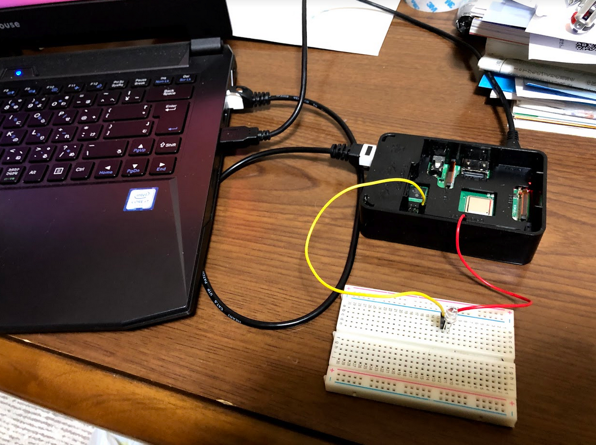
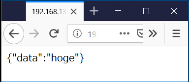

# 2018ロボットシステム学課題2
## 動作説明
 ROSのノードで指令を送りLEDを点滅させ,ウェブサーバに現在の指令を表示させる <p> 
動画 
https://m.youtube.com/watch?v=ucs8MQCBmdk
### 動作環境

|||
|:--:|:--:|
|Raspberry Pi|Raspberry Pi Model 3B+|
|OS| Ubuntu16.04|
## 回路説明
* GPIO25とGNDの間にLEDを接続
  * GPIO25: 22番ピン
  * GND: 39番ピン

## インストール方法
* git clone
```
$ git clone https://github.com/hatakeyamayuta/robosyskadai2.git
```
* 始めに「ワークスペース」を作る
```
$ cd
$ mkdir -p catkin_ws/src
$ cd ~/catkin_ws/src
$ catkin_init_workspace
$ cd ~/catkin_ws
$ catkin_make
$ source ~/.bashrc
```
* パッケージの生成しmypkg内にcloneしてきたscriptsとlaunchを入れる
```
$ cd ~/catkin_ws/src
$ catkin_create_pkg mypkg rospy
$ cd mypkg/
$ cp -r /home/username/robosyskadai2/* .
```
### 実行方法
* 立ち上げ
```
$ roslaunch mypkg mypkg.launch 
```
* 点灯，消灯，点滅
```
$ cd
$ echo on > switch.txt
$ echo off > switch.txt
$ echo 適当な文字　> switch.txt
```
* 手元のPCのブラウザで`http://ラズパイのIPアドレス:8000`で現在の指令を確認できる

### 参考文献
* ロボットシステム学2018第13回   
https://github.com/ryuichiueda/robosys2018/blob/master/13.md  


